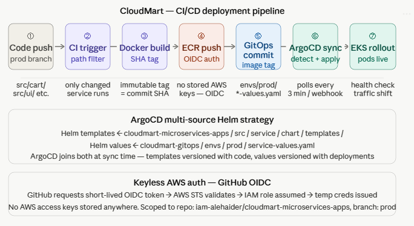
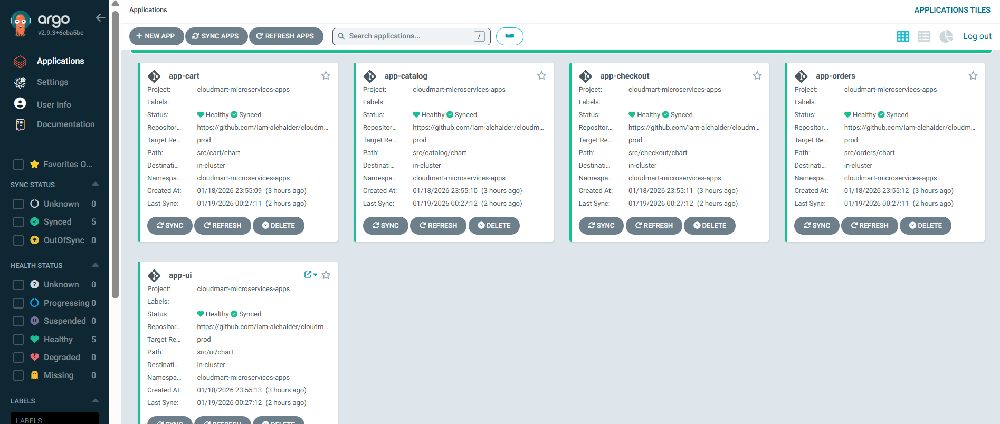
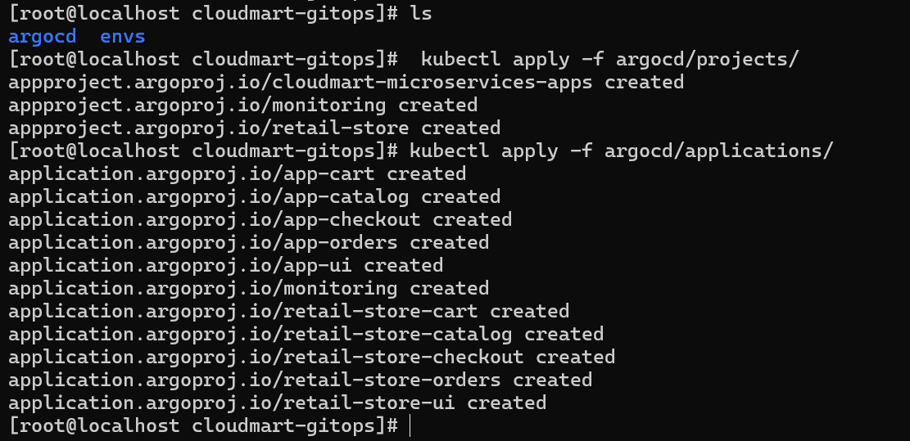
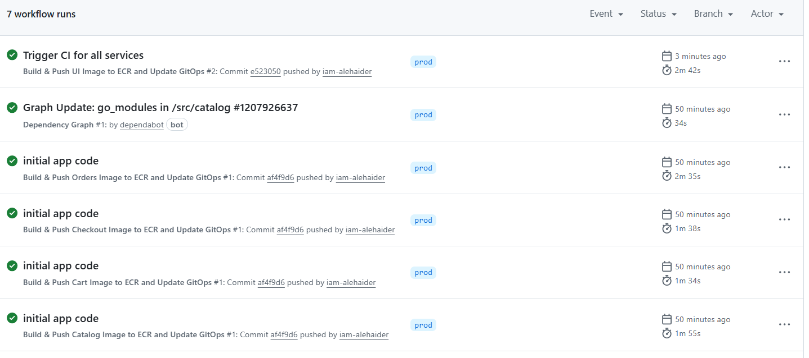
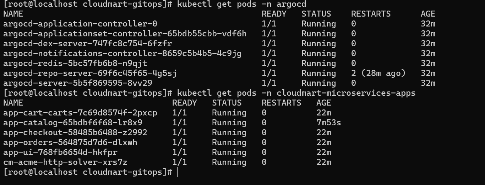

# CloudMart GitOps

[](https://github.com/iam-alehaider/cloudmart-gitops)
[](https://argoproj.github.io/cd/)
[](LICENSE)

This is the **GitOps configuration repository** for the CloudMart retail platform. It is the single source of truth for what is deployed to the production Kubernetes cluster. ArgoCD continuously watches this repository and reconciles the cluster state to match what is declared here.

No application code or Helm chart templates live in this repository — only ArgoCD Application manifests and per-environment Helm values files (primarily image tags).

---

## Table of Contents

- [Role in the GitOps Pipeline](#role-in-the-gitops-pipeline)
- [Screenshots & Demo](#screenshots--demo)
- [Repository Structure](#repository-structure)
- [ArgoCD Application Manifests](#argocd-application-manifests)
- [Multi-Source Helm Strategy](#multi-source-helm-strategy)
- [Environment Values](#environment-values)
- [ArgoCD Project](#argocd-project)
- [Sync Policy](#sync-policy)
- [Sync Waves](#sync-waves)
- [How a Deployment Happens](#how-a-deployment-happens)
- [Manual Sync](#manual-sync)

---

## Role in the GitOps Pipeline

```
cloudmart-microservices-apps   ──CI──►  cloudmart-gitops  ──ArgoCD──►  EKS Cluster
(source code + Helm templates)           (image tags + ArgoCD apps)    (running pods)
```

The CI pipeline in `cloudmart-microservices-apps` is the **only writer** to this repository. When a new image is built and pushed to ECR, CI commits a one-line change to `envs/prod/<service>-values.yaml` updating the image tag. ArgoCD detects the change within 3 minutes (or immediately via webhook) and rolls out the new version.

**This repository is never edited manually for deployments.**

---

## CI/CD Deployment Pipeline



> Full 7-step pipeline: code push → CI trigger → Docker build → ECR push → GitOps commit → ArgoCD sync → EKS rollout. Also shows the ArgoCD multi-source Helm strategy and keyless AWS OIDC auth.

### ArgoCD Applications — All Healthy & Synced

> All 5 microservices (cart, catalog, checkout, orders, ui) deployed via GitOps — Healthy & Synced across the `cloudmart-microservices-apps` project.

### ArgoCD Projects & Applications Applied

> `kubectl apply` creating all ArgoCD AppProjects and Application resources from the `argocd/` directory — 11 resources created in a single command.

### GitHub Actions — All CI Workflows Passing

> 7 workflow runs all passing on the `prod` branch — per-service builds for cart, catalog, checkout, orders, and ui triggered by individual path filters.

### All Pods Running — ArgoCD + Microservices

> All ArgoCD system pods running in the `argocd` namespace, and all 5 application pods running in `cloudmart-microservices-apps` — zero restarts.

> **Note:** Upload these images to a `docs/screenshots/` folder in this repository to display them here.

---

## Repository Structure

```
cloudmart-gitops/
├── argocd/
│   ├── applications/
│   │   ├── retail-store-cart.yaml
│   │   ├── retail-store-catalog.yaml
│   │   ├── retail-store-checkout.yaml
│   │   ├── retail-store-orders.yaml
│   │   └── retail-store-ui.yaml
│   └── projects/
│       └── retail-store-project.yaml
└── envs/
    └── prod/
        ├── cart-values.yaml
        ├── catalog-values.yaml
        ├── checkout-values.yaml
        ├── orders-values.yaml
        └── ui-values.yaml
```

---

## ArgoCD Application Manifests

Each file under `argocd/applications/` defines one ArgoCD `Application` resource — one per microservice. ArgoCD reads these files and manages the deployment lifecycle of each service independently.

### Example — Cart Application

```yaml
apiVersion: argoproj.io/v1alpha1
kind: Application
metadata:
  name: retail-store-cart
  namespace: argocd
  annotations:
    argocd.argoproj.io/sync-wave: "1"
spec:
  project: retail-store

  sources:
    # Source 1: Helm chart templates from the application repo
    - repoURL: https://github.com/iam-alehaider/cloudmart-microservices-apps.git
      targetRevision: prod
      path: src/cart/chart
      helm:
        valueFiles:
          - $values/envs/prod/cart-values.yaml

    # Source 2: Environment-specific values from this GitOps repo
    - repoURL: https://github.com/iam-alehaider/cloudmart-gitops.git
      targetRevision: main
      ref: values

  destination:
    server: https://kubernetes.default.svc
    namespace: retail-store

  syncPolicy:
    automated:
      prune: true
      selfHeal: true
    syncOptions:
      - CreateNamespace=true
```

### Services and Sync Waves

| Service | ArgoCD Application | Sync Wave | Namespace |
|---|---|---|---|
| Cart | `retail-store-cart` | 1 | `retail-store` |
| Catalog | `retail-store-catalog` | 1 | `retail-store` |
| Checkout | `retail-store-checkout` | 1 | `retail-store` |
| Orders | `retail-store-orders` | 1 | `retail-store` |
| UI | `retail-store-ui` | **2** | `retail-store` |

The UI is deployed in wave 2 to ensure all backend services are available before the frontend starts receiving traffic.

---

## Multi-Source Helm Strategy

ArgoCD's multi-source feature allows chart templates and values to live in different repositories. This is the key architectural decision in this GitOps setup:

| What | Where |
|---|---|
| Helm chart templates (`deployment.yaml`, `service.yaml`, etc.) | `cloudmart-microservices-apps/src/<service>/chart/templates/` |
| Default chart values | `cloudmart-microservices-apps/src/<service>/chart/values.yaml` |
| **Environment-specific values (image tag)** | **`cloudmart-gitops/envs/prod/<service>-values.yaml`** (this repo) |

The `$values` reference in the Application manifest is an ArgoCD multi-source alias — it tells ArgoCD to resolve `$values/envs/prod/cart-values.yaml` from the second source (this repo, `ref: values`).

### Benefits

- **Separation of concerns** — application developers own the chart templates; the GitOps repo is the deployment configuration.
- **Auditability** — every production deployment is a traceable Git commit in this repo.
- **Rollback** — revert the image tag commit to instantly roll back to a previous image.
- **No cluster access needed for deployments** — everything flows through Git.

---

## Environment Values

The `envs/prod/<service>-values.yaml` files contain only the values that differ between environments — primarily the image tag. All other Helm values (replica count, resource limits, HPA config) are inherited from the chart's `values.yaml` defaults.

### Example — `envs/prod/cart-values.yaml`

```yaml
image:
  repository: 119778517587.dkr.ecr.us-west-2.amazonaws.com/demo-private/cart
  tag: a1b2c3d    # ← This line is updated by CI on every build
```

### What CI Writes (and Only This)

```bash
yq -i '.image.tag = env(IMAGE_TAG)' envs/prod/cart-values.yaml
```

The commit message format is: `Update cart image tag to <sha>`

---

## ArgoCD Project

The `retail-store` ArgoCD project scopes permissions to exactly what this platform needs — no more.

```yaml
apiVersion: argoproj.io/v1alpha1
kind: AppProject
metadata:
  name: retail-store
  namespace: argocd
spec:
  sourceRepos:
    - 'https://github.com/iam-alehaider/cloudmart-microservices-apps.git'
    - 'https://github.com/iam-alehaider/cloudmart-gitops.git'

  destinations:
    - namespace: retail-store
      server: https://kubernetes.default.svc

  clusterResourceWhitelist:
    - group: ''
      kind: Namespace
    - group: 'rbac.authorization.k8s.io'
      kind: ClusterRole
    - group: 'rbac.authorization.k8s.io'
      kind: ClusterRoleBinding

  namespaceResourceWhitelist:
    - group: 'apps'
      kind: Deployment
    - group: 'autoscaling'
      kind: HorizontalPodAutoscaler
    - group: 'policy'
      kind: PodDisruptionBudget
    # ... and other whitelisted kinds
```

---

## Sync Policy

All applications use `automated` sync with the following settings:

| Setting | Value | Effect |
|---|---|---|
| `automated.prune` | `true` | Resources deleted from Git are deleted from the cluster |
| `automated.selfHeal` | `true` | Manual cluster changes are reverted back to Git state |
| `syncOptions.CreateNamespace` | `true` | ArgoCD creates the `retail-store` namespace if it doesn't exist |

Self-heal ensures the cluster state **always** matches this repository — no configuration drift is possible.

---

## Sync Waves

ArgoCD sync waves control deployment ordering within a sync operation. Wave numbers are set via the annotation `argocd.argoproj.io/sync-wave`.

```
Wave 1: cart, catalog, checkout, orders  (backend services)
Wave 2: ui                               (frontend — depends on backends)
```

Wave 1 resources are fully healthy before wave 2 begins.

---

## How a Deployment Happens

```
1. Developer pushes code to cloudmart-microservices-apps (prod branch)
2. GitHub Actions CI pipeline runs:
   a. Builds Docker image for the changed service
   b. Pushes image to Amazon ECR with tag = git commit SHA
   c. Checks out this repo (cloudmart-gitops)
   d. Updates envs/prod/<service>-values.yaml with new image tag
   e. Commits and pushes to this repo
3. ArgoCD detects the change (poll: every 3 min, or webhook: immediate)
4. ArgoCD reads the Application manifest
5. ArgoCD fetches:
   - Helm templates from cloudmart-microservices-apps (prod branch)
   - Values from cloudmart-gitops (main branch, envs/prod/)
6. ArgoCD renders Kubernetes manifests (helm template)
7. ArgoCD applies manifests to EKS
8. Kubernetes pulls new image from ECR
9. Health checks pass → new pods serve traffic
```

---

## Manual Sync

If immediate sync is needed (e.g., after a config change in this repo without a CI trigger):

```bash
# Sync all services
argocd app sync -l app.kubernetes.io/part-of=retail-store

# Sync a single service
argocd app sync retail-store-cart

# Check sync status
argocd app list
```

---

**Related Repositories**

- [cloudmart-microservices-apps](https://github.com/iam-alehaider/cloudmart-microservices-apps) — Service source code, Dockerfiles, Helm chart templates, CI pipelines
- [cloudmart-infra](https://github.com/iam-alehaider/cloudmart-infra) — Terraform infrastructure (EKS, VPC, ArgoCD, monitoring)


